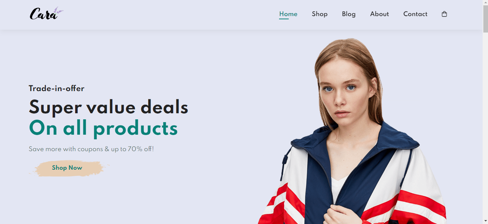
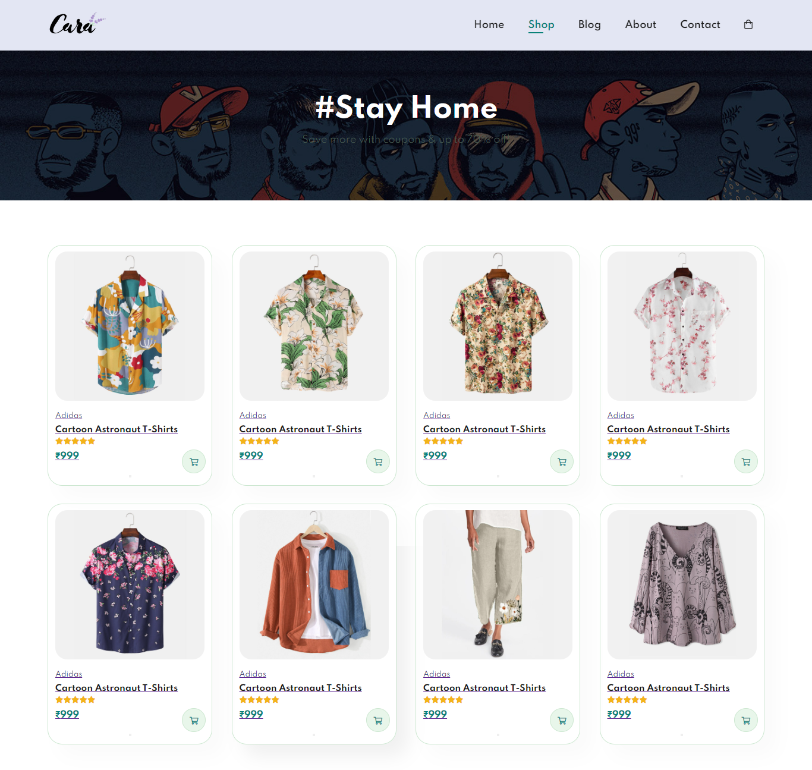

# FrontEnd Site of our eCommerce Project

Made with [React](https://react.dev/) and [Vite](https://vitejs.dev/) with couple of other libraries for api integration and state management.

### Dependencies used 🌳

-  [Axios](https://axios-http.com/docs/intro) - for api integration.
-  [Zustand](https://zustand-demo.pmnd.rs/) - for state management.

### Contributors ✨

-  [AndreW13-sp](https://github.com/AndreW13-sp)
-  [ayush-dedhia25](https://github.com/ayush-dedhia25)
-  [ShreeSamal](https://github.com/)

### Screenshots 📸

